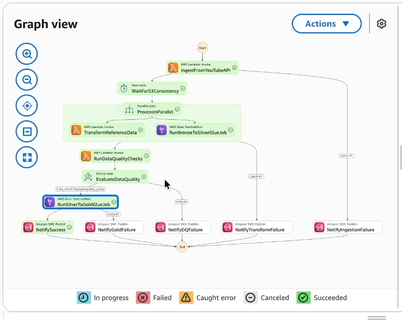

# YouTube Trending Data Pipeline

A cloud-native ETL pipeline that ingests YouTube trending video data across 10 regions, transforms it through a medallion architecture (Bronze > Silver > Gold), enforces data quality gates, and produces analytics-ready aggregations — all orchestrated by AWS Step Functions.


---

## Table of Contents

- [Overview](#overview)
- [Why I Built This](#why-i-built-this)
- [Architecture](#architecture)
- [Tech Stack](#tech-stack)
- [Project Structure](#project-structure)
- [Data Flow](#data-flow)
  - [Bronze Layer (Raw Data)](#bronze-layer-raw-data)
  - [Silver Layer (Cleansed Data)](#silver-layer-cleansed-data)
  - [Data Quality Gate](#data-quality-gate)
  - [Gold Layer (Business Aggregations)](#gold-layer-business-aggregations)
- [Gold Layer Output Tables](#gold-layer-output-tables)
- [Prerequisites](#prerequisites)
- [AWS Infrastructure Setup](#aws-infrastructure-setup)
- [Configuration](#configuration)
- [Deployment](#deployment)
- [Running the Pipeline](#running-the-pipeline)
- [Monitoring and Alerting](#monitoring-and-alerting)
- [Supported Regions](#supported-regions)
- [Data Sources](#data-sources)
- [What I Learned / Challenges Along the Way](#what-i-learned--challenges-along-the-way)

---

## Overview

This pipeline automates the end-to-end process of collecting, cleaning, and analyzing YouTube trending video data. It replaces manual Kaggle dataset downloads with live YouTube Data API v3 integration and produces three sets of business analytics tables:

- **Trending Analytics** — daily trending metrics per region (total videos, views, engagement rates)
- **Channel Analytics** — channel-level performance and ranking across regions
- **Category Analytics** — category-level breakdowns with view share percentages

The pipeline supports **10 regions** and runs on a configurable schedule via AWS EventBridge.

---

## Why I Built This

I started with the classic Kaggle "YouTube Trending Videos" dataset - a static CSV dump that stops updating the moment it's downloaded. That's fine for a one-off notebook, but it bothered me: it isn't how trending data actually behaves in the real world, and it isn't how data teams actually work with it either.

So I set out to rebuild the same idea as a *living* pipeline: pull real trending videos straight from the YouTube Data API on a schedule, run them through proper Bronze → Silver → Gold layering, gate anything that moves to Gold behind data quality checks, and orchestrate the whole thing with Step Functions instead of a notebook cell run top to bottom. The Kaggle CSVs are still in here — I kept them as a way to backfill history and stress-test the transform logic against a second, differently-shaped data source, which turned out to be more useful than I expected (more on that below).

The goal wasn't just "make an ETL pipeline" — it was to build something close to what a real analytics platform on AWS looks like end to end: ingestion, transformation, quality gates, orchestration, monitoring, and alerting, all wired together.

---

## Architecture

The pipeline follows the **Medallion Architecture** pattern with three data layers:

```
Data Sources          Bronze              Silver            Quality Gate          Gold              Analytics
┌──────────┐     ┌──────────────┐    ┌──────────────┐    ┌────────────┐    ┌──────────────┐    ┌──────────┐
│ YouTube  │     │              │    │              │    │            │    │  trending_   │    │          │
│ API v3   │────>│  Raw JSON    │───>│  Cleansed    │───>│  DQ Lambda │───>│  analytics   │───>│  Athena  │
│          │     │  (S3)        │    │  Parquet     │    │  Validates │    │              │    │          │
├──────────┤     │              │    │  (S3)        │    │  row count │    │  channel_    │    ├──────────┤
│ Kaggle   │     │  Raw CSV     │    │              │    │  nulls     │    │  analytics   │    │  Quick-  │
│ Dataset  │────>│  (S3)        │    │  Reference   │    │  schema    │    │              │    │  Sight   │
│          │     │              │    │  Parquet     │    │  freshness │    │  category_   │    │          │
└──────────┘     └──────────────┘    └──────────────┘    └────────────┘    │  analytics   │    └──────────┘
                                                              │           └──────────────┘
                                                         fail │
                                                              ▼
                                                        ┌────────────┐
                                                        │  SNS Alert │
                                                        └────────────┘
```

**Orchestration** is handled by AWS Step Functions, which coordinates the full pipeline with retry logic, parallel execution, and failure notifications.

---

## Tech Stack

| Component           | Technology                          |
|---------------------|-------------------------------------|
| **Compute**         | AWS Lambda, AWS Glue (PySpark)      |
| **Storage**         | Amazon S3 (Parquet, Snappy)         |
| **Orchestration**   | AWS Step Functions                  |
| **Scheduling**      | Amazon EventBridge                  |
| **Metadata**        | AWS Glue Data Catalog               |
| **Query Engine**    | Amazon Athena                       |
| **Alerting**        | Amazon SNS                          |
| **Monitoring**      | Amazon CloudWatch                   |
| **Security**        | AWS IAM                             |
| **Languages**       | Python 3, PySpark, SQL              |
| **Libraries**       | Pandas, AWS Wrangler, Boto3         |
| **Data Format**     | Parquet (Snappy compression)        |

---

## Project Structure

```
youtube_data_pipeline/
│
├── lambda/
│   ├── youtube_api_ingestion/         # Ingestion Lambda
│   │   └── lambda_function.py         # Fetches trending videos & categories from YouTube API
│   ├── json_to_parquet/               # Reference data transformation Lambda
│   │   └── lambda_bronze_to_silver.py # Converts JSON category mappings to Parquet
│   └── csv_to_parquet/                # Kaggle CSV transformation Lambda
│       └── lambda_bronze_to_silver.py # Converts historical Kaggle CSVs to Parquet
│
├── glue_jobs/
│   ├── bronze_to_silver_statistics.py # PySpark job: raw data → cleansed statistics
│   └── silver_to_gold_analytics.py    # PySpark job: cleansed data → business aggregations
│
├── data quality/
│   └── dq_lambda.py                   # Data quality validation Lambda
│
├── step functions/
│   └── pipeline_orchestration.json    # Step Functions state machine definition
│
├── scripts/
│   ├── aws_copy.sh                    # Upload historical data to Bronze S3 bucket
│   └── information.md                 # AWS resource names & configuration reference (gitignored)
│
├── data/                              # Reference & historical data (gitignored)
│   ├── {region}videos.csv             # Kaggle trending video datasets (10 regions)
│   └── {region}_category_id.json      # YouTube category ID mappings (10 regions)
│
└── YouTube Trending Data Pipeline.png # Architecture diagram
```

---

## Data Flow

### Bronze Layer (Raw Data)

The ingestion Lambda (`youtube_api_ingestion`) fetches data from the YouTube Data API v3:

- **Trending videos** — top 50 trending videos per region
- **Category mappings** — video category ID-to-name reference data

Data is stored as raw JSON in S3, partitioned by region, date, and hour:

```
s3://bronze-bucket/youtube/raw_statistics/region=US/date=2026-04-01/hour=12/
s3://bronze-bucket/youtube/raw_statistics_reference_data/region=US/
```

Historical Kaggle CSV data can also be uploaded to the Bronze layer via the `aws_copy.sh` script.

### Silver Layer (Cleansed Data)

Two parallel transformations run on Bronze data:

**1. Statistics (Glue Job: `bronze_to_silver_statistics`)**
- Schema enforcement across both API JSON and Kaggle CSV formats
- Type casting (views, likes, dislikes → Long; dates parsed)
- Null handling and region standardization
- Deduplication (latest record per video/region/date)
- Derived metrics: `like_ratio`, `engagement_rate`
- Output: Parquet with Snappy compression, partitioned by region

**2. Reference Data (Lambda: `json_to_parquet`)**
- Normalizes JSON category mappings to tabular format
- Deduplicates category entries
- Output: Parquet, partitioned by region

### Data Quality Gate

Before data moves to Gold, the DQ Lambda (`dq_lambda`) validates Silver data:

| Check              | Threshold                  |
|--------------------|----------------------------|
| Row count          | >= 10 rows                 |
| Null percentage    | <= 5% on critical columns  |
| Schema validation  | Required columns present   |
| Value ranges       | Views sanity check         |
| Data freshness     | < 48 hours since last data |

If any check fails, the pipeline halts and sends an **SNS alert** with failure details. Gold aggregation does not execute.

### Gold Layer (Business Aggregations)

The Glue job (`silver_to_gold_analytics`) produces three analytics tables from cleansed Silver data:

---

## Gold Layer Output Tables

### `trending_analytics`

Daily trending metrics aggregated per region.

| Column                | Description                          |
|-----------------------|--------------------------------------|
| `region`              | Country code (US, GB, IN, etc.)      |
| `trending_date_parsed`| Date of trending snapshot            |
| `total_videos`        | Number of trending videos            |
| `total_views`         | Sum of all views                     |
| `total_likes`         | Sum of all likes                     |
| `avg_views_per_video` | Average views per trending video     |
| `avg_like_ratio`      | Average like-to-view ratio           |
| `avg_engagement_rate` | Average engagement rate              |
| `unique_channels`     | Count of distinct channels           |
| `unique_categories`   | Count of distinct categories         |

### `channel_analytics`

Channel-level performance and ranking.

| Column               | Description                           |
|----------------------|---------------------------------------|
| `channel_title`      | YouTube channel name                  |
| `region`             | Country code                          |
| `total_videos`       | Videos that trended                   |
| `total_views`        | Total views across trending videos    |
| `avg_engagement_rate`| Average engagement rate               |
| `times_trending`     | Number of times appeared in trending  |
| `rank_in_region`     | Performance rank within the region    |
| `categories`         | Categories the channel appears in     |

### `category_analytics`

Category-level breakdowns with view share.

| Column               | Description                           |
|----------------------|---------------------------------------|
| `category`           | Video category name                   |
| `region`             | Country code                          |
| `trending_date_parsed`| Date of trending snapshot            |
| `video_count`        | Number of videos in category          |
| `total_views`        | Total views for the category          |
| `avg_engagement_rate`| Average engagement rate               |
| `view_share_pct`     | Percentage of total views             |

All Gold tables are stored as Parquet (Snappy compressed), partitioned by `region`, and registered in the Glue Data Catalog for Athena queries.

---

## Prerequisites

- **AWS Account** with permissions to create Lambda, Glue, S3, Step Functions, SNS, IAM, Athena, EventBridge, and CloudWatch resources
- **YouTube Data API v3 key** — obtain from the [Google Cloud Console](https://console.cloud.google.com/apis/credentials)
- **AWS CLI** configured with appropriate credentials
- **Python 3.9+**

---

## AWS Infrastructure Setup

Create the following S3 buckets:

```bash
aws s3 mb s3://yt-data-pipeline-bronze-<region>-<env>
aws s3 mb s3://yt-data-pipeline-silver-<region>-<env>
aws s3 mb s3://yt-data-pipeline-gold-<region>-<env>
aws s3 mb s3://yt-data-pipeline-script-<region>-<env>
```

Create Glue databases:

```bash
aws glue create-database --database-input '{"Name": "yt_pipeline_bronze_<env>"}'
aws glue create-database --database-input '{"Name": "yt_pipeline_silver_<env>"}'
aws glue create-database --database-input '{"Name": "yt_pipeline_gold_<env>"}'
```

Create an SNS topic for alerts:

```bash
aws sns create-topic --name yt-data-pipeline-alerts-<env>
aws sns subscribe --topic-arn <topic-arn> --protocol email --notification-endpoint <your-email>
```

---

## Configuration

### Environment Variables

#### Ingestion Lambda

| Variable            | Description                        | Example                                     |
|---------------------|------------------------------------|----------------------------------------------|
| `YOUTUBE_API_KEY`   | YouTube Data API v3 key            | `AIzaSy...`                                  |
| `S3_BUCKET_BRONZE`  | Bronze S3 bucket name              | `yt-data-pipeline-bronze-eu-west-2-dev`      |
| `YOUTUBE_REGIONS`   | Comma-separated region codes       | `US,GB,CA,DE,FR,IN,JP,KR,MX,RU`             |

#### Data Quality Lambda

| Variable                | Description                    | Default |
|-------------------------|--------------------------------|---------|
| `S3_BUCKET_SILVER`      | Silver S3 bucket name          | —       |
| `GLUE_DB_SILVER`        | Silver Glue database name      | `yt_pipeline_silver_dev` |
| `SNS_ALERT_TOPIC_ARN`   | SNS topic ARN for alerts       | —       |
| `DQ_MIN_ROW_COUNT`      | Minimum row count threshold    | `10`    |
| `DQ_MAX_NULL_PERCENT`   | Maximum null percentage allowed| `5.0`   |

#### Glue Jobs

Glue job parameters are passed via the Step Functions state machine or directly via `--arguments`:

| Parameter            | Description                     |
|----------------------|---------------------------------|
| `--bronze_database`  | Bronze Glue database name       |
| `--bronze_table`     | Bronze table name               |
| `--silver_database`  | Silver Glue database name       |
| `--silver_bucket`    | Silver S3 bucket name           |
| `--gold_database`    | Gold Glue database name         |
| `--gold_bucket`      | Gold S3 bucket name             |

---

## Deployment

### 1. Upload Glue job scripts to S3

```bash
aws s3 cp glue_jobs/bronze_to_silver_statistics.py s3://yt-data-pipeline-script-<region>-<env>/glue_jobs/
aws s3 cp glue_jobs/silver_to_gold_analytics.py s3://yt-data-pipeline-script-<region>-<env>/glue_jobs/
```

### 2. Deploy Lambda functions

Package and deploy each Lambda:

```bash
# Ingestion Lambda
cd lambda/youtube_api_ingestion
zip -r function.zip lambda_function.py
aws lambda create-function \
  --function-name yt-data-pipeline-youtube-ingestion-<env> \
  --runtime python3.9 \
  --handler lambda_function.lambda_handler \
  --zip-file fileb://function.zip \
  --role <lambda-execution-role-arn> \
  --timeout 300 \
  --memory-size 256

# Repeat for lambda/json_to_parquet, lambda/csv_to_parquet, and "data quality" Lambdas
```

### 3. Create Glue jobs

```bash
aws glue create-job \
  --name yt-data-pipeline-bronze-to-silver-<env> \
  --role <glue-role-arn> \
  --command '{"Name":"glueetl","ScriptLocation":"s3://yt-data-pipeline-script-<region>-<env>/glue_jobs/bronze_to_silver_statistics.py"}' \
  --glue-version "4.0" \
  --number-of-workers 2 \
  --worker-type G.1X
```

### 4. Deploy Step Functions state machine

```bash
aws stepfunctions create-state-machine \
  --name yt-data-pipeline \
  --definition file://"step functions/pipeline_orchestration.json" \
  --role-arn <step-functions-role-arn>
```

### 5. (Optional) Upload historical Kaggle data

```bash
cd data
bash ../scripts/aws_copy.sh
```

---

## Running the Pipeline

### Automated (Recommended)

Set up an EventBridge rule to trigger the Step Functions state machine on a schedule:

```bash
aws events put-rule \
  --name yt-pipeline-schedule \
  --schedule-expression "rate(6 hours)"

aws events put-targets \
  --rule yt-pipeline-schedule \
  --targets '[{"Id":"1","Arn":"<state-machine-arn>","RoleArn":"<eventbridge-role-arn>"}]'
```

### Manual

```bash
aws stepfunctions start-execution \
  --state-machine-arn <state-machine-arn>
```

### Pipeline Execution Order

```
1. Ingestion          → Fetch data from YouTube API → Bronze S3
2. Wait               → Brief pause for data consistency
3. Silver transforms  → Run in parallel:
   ├── Glue Job: bronze_to_silver_statistics
   └── Lambda: json_to_parquet (reference data)
4. Data Quality       → Validate Silver data (blocks on failure)
5. Gold aggregation   → Glue Job: silver_to_gold_analytics
6. Notification       → SNS success/failure alert
```

Each step includes retry logic (3 attempts with exponential backoff). Failures at any stage trigger SNS notifications with error details.

Here's what a successful execution graph looks like in the Step Functions console — ingestion runs first, the Silver transforms fan out in parallel, and the pipeline only reaches Gold aggregation after the data quality gate passes:



---

## Monitoring and Alerting

- **Step Functions Console** — visual execution history and step-level status
- **CloudWatch Logs** — detailed logs from Lambda functions and Glue jobs
- **SNS Notifications** — email/SMS alerts on pipeline success or failure
- **Athena** — query Gold tables directly for data validation

```sql
-- Example: Top trending channels in the US
SELECT channel_title, total_views, times_trending
FROM yt_pipeline_gold_dev.channel_analytics
WHERE region = 'US'
ORDER BY total_views DESC
LIMIT 10;
```

---

## Supported Regions

| Code | Country        |
|------|----------------|
| US   | United States  |
| GB   | United Kingdom |
| CA   | Canada         |
| DE   | Germany        |
| FR   | France         |
| IN   | India          |
| JP   | Japan          |
| KR   | South Korea    |
| MX   | Mexico         |
| RU   | Russia         |

---

## Data Sources

- **YouTube Data API v3** — live trending video data (primary)
- **Kaggle YouTube Trending Dataset** — historical data for backfill and testing

---

## What I Learned / Challenges Along the Way

**Two data sources, one schema.** The Kaggle CSVs are already flat (`views`, `likes`, `channel_title`, ...), but the live YouTube API returns deeply nested JSON (`snippet.title`, `statistics.viewCount`, ...). Rather than write two separate downstream pipelines, the Bronze-to-Silver Glue job detects which shape it received and flattens the API response to match the CSV's schema before anything else happens. Getting this branch right — and keeping both paths producing an identical Silver schema — was most of the actual engineering effort in this project.

**`pandas.json_normalize` doesn't like mixed-type JSON.** The category reference JSON has top-level scalar fields (`kind`, `etag`) sitting next to a nested `items` array. Feeding that straight into `awswrangler.s3.read_json()` failed with an ambiguous-ordering error, because pandas couldn't decide how to align dicts against a Series. The fix was to read the raw JSON with plain `boto3` + `json.loads()` first, then normalize only the `items` array — a small change, but one that took a while to track down.

**Idempotency matters more than it sounds.** Early versions of the reference-data Lambda used plain `append` writes to Parquet, which meant re-running the pipeline (say, after fixing a bug) duplicated every category record. Switching to `mode="overwrite_partitions"` in `awswrangler.s3.to_parquet()` made re-runs safe — a lesson that generalizes to basically any pipeline step that might get retried.

**Data quality gates need to actually gate something.** It's easy to log a warning and move on. Wiring the DQ Lambda into Step Functions as a real `Choice` state — one that halts Gold aggregation and fires an SNS alert on failure — forced me to think about what "bad data" actually means for this dataset (row count floors, null thresholds on critical columns, a freshness check) instead of just eyeballing the output.

**Region migration.** Midway through, I moved the underlying AWS resources from `ap-south-1` to `eu-west-2` (closer to where I actually needed lower latency). That meant updating account/region identifiers across the Step Functions definition, Lambda ARNs, and S3 bucket names — a good reminder to keep environment-specific values in parameters/config rather than hardcoding them, which is a change I'd make if I extended this further.
